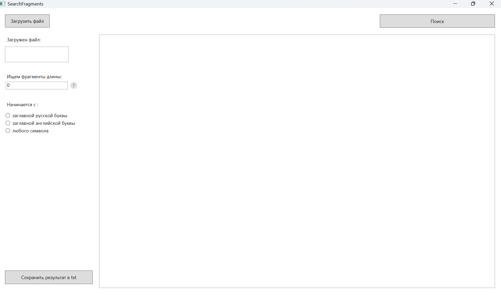
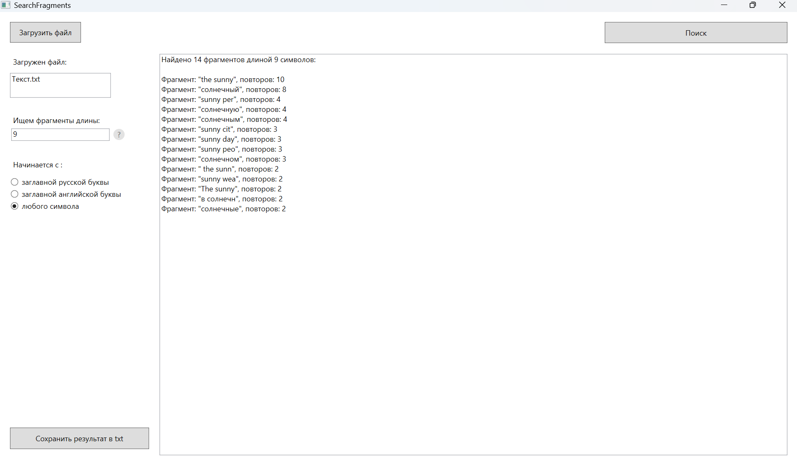
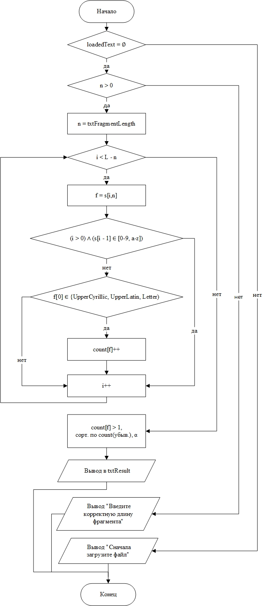
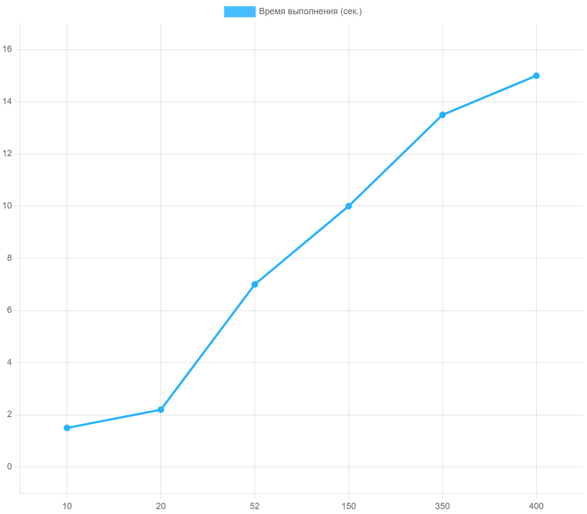

# SearchFragments — Программа поиска повторяющихся фрагментов в тексте

SearchFragments — это специализированная утилита, разработанная на языке **C#** в рамках **WPF-проекта**, предназначенная для автоматизированного обнаружения повторяющихся текстовых блоков в документах различных форматов. Программа разработана студенткой 2 курса СГУ Яфаровой Эльвиной Эрнестовной под руководством д.т.н., проф. А. С. Богомолова.

## 📖 Обзор проекта
Программа позволяет находить повторы не только на уровне отдельных слов, но и на уровне фрагментов фиксированной длины с гибкой фильтрацией. Основное преимущество инструмента — **локальная работа**, что исключает риски утечки данных, характерные для онлайн-сервисов.

### ⚖️ Сравнение с существующими решениями
В ходе исследования был проведен анализ конкурентов, который выявил отсутствие инструментов с аналогичным уровнем автоматизации и гибкости настроек.

| Инструмент | Ограничения | Преимущество SearchFragments |
| :--- | :--- | :---|
| Duplicate Finder | Не находит повторы внутри одного документа. | Поиск дубликатов внутри текста. |
| Duplicate Word Finder | Специализируется только на отдельных словах. | Поиск фрагментов любой заданной длины. |
| Андубликатор | Требует заранее заданных слов для удаления. | Автоматическое выявление неизвестных повторов. |
| Свежий взгляд | Фокус на стилистике, нет настройки длины фрагмента. | Точная настройка параметров поиска. |
| Planetcalc | Базовый частотный анализ без учета контекста. | Учет границ слов и специфических фильтров. |

---

## 🖥 Интерфейс и возможности

Программа обладает интуитивно понятным интерфейсом, разработанным на платформе **WPF**.

  
   
  <i>Рисунок 1. Главное окно приложения при начальном запуске (соответствует Рисунку 7 в курсовой работе).</i>

### Основной функционал:
1.  **Загрузка данных:** Импорт файлов через стандартные диалоговые окна.
2.  **Настройка поиска:** Задание длины фрагмента и выбор фильтра (заглавная кириллица, латиница, любой символ).
3.  **Визуализация:** Отображение списка найденных фрагментов с частотой их упоминания.
4.  **Экспорт:** Сохранение результатов в формат TXT.

  
   
  <i>Рисунок 2. Пример работы программы: поиск фрагментов (соответствует Рисунку 13 в курсовой работе).</i>

---

## 🛠 Технологический стек и алгоритмы

Реализация опирается на современные библиотеки обработки документов и эффективные алгоритмы анализа данных.

### Используемые библиотеки:
* **iText7:** Извлечение текста из PDF с помощью авторского класса `SpacingAwareTextExtractionStrategy`.
* **Aspose.Words & OpenXML:** Поддержка форматов Word (DOC/DOCX) без установки MS Office.
* **LINQ:** Высокоскоростная фильтрация и сортировка коллекций.

### Алгоритмическая база:
В проекте реализован **гибридный подход**, объединяющий преимущества хеш-функций (принцип **Рабина-Карпа**) и суффиксных структур данных.

  
   
  <i>Рисунок 3. Схема алгоритма поиска повторяющихся фрагментов (соответствует Рисунку 4 в курсовой работе).</i>

---

## 📊 Производительность

Тестирование подтвердило масштабируемость и стабильность алгоритма.

| Объем документа (стр.) | Время обработки (сек.) |
| :--- | :--- |
| 10–20 | 2.2 |
| 40–70 | 7.0 |
| 350–400 | 13.5 |

  
   
  <i>Рисунок 4. График зависимости времени выполнения от объема текста (соответствует Рисунку 18 в курсовой работе).</i>

---

## 🌟 Практическая значимость

Программное обеспечение прошло апробацию при подготовке монографии сотрудников **СГУ** и **ИПУ им. В. А. Трапезникова РАН** объемом более 350 страниц, показав высокую точность выявления дубликатов.

---

## 🚀 Инструкция по запуску

1.  Скачайте архив с дистрибутивом из раздела **Releases**.
2.  Запустите файл `setup.exe` из папки «Программа».
3.  Следуйте инструкциям установщика.
4.  После установки запустите приложение через ярлык на рабочем столе.

---

## 📄 Документация
Подробное описание разработки, алгоритмов и руководство пользователя доступны в следующих файлах:
* [Пояснительная записка (Курсовая работа)](docs/Курсовая_работа.pdf) — содержит теоретический анализ, сравнение алгоритмов и результаты тестирования.
* [Презентация проекта](docs/Презентация_по_курсовой_работе.pdf) — краткий обзор ключевых возможностей и стека технологий.

**Разработано:** Яфаровой Эльвиной Эрнестовной  
**Руководитель:** д.т.н., проф. А. С. Богомолов  
*Кафедра математической кибернетики и компьютерных наук СГУ, 2025.*
